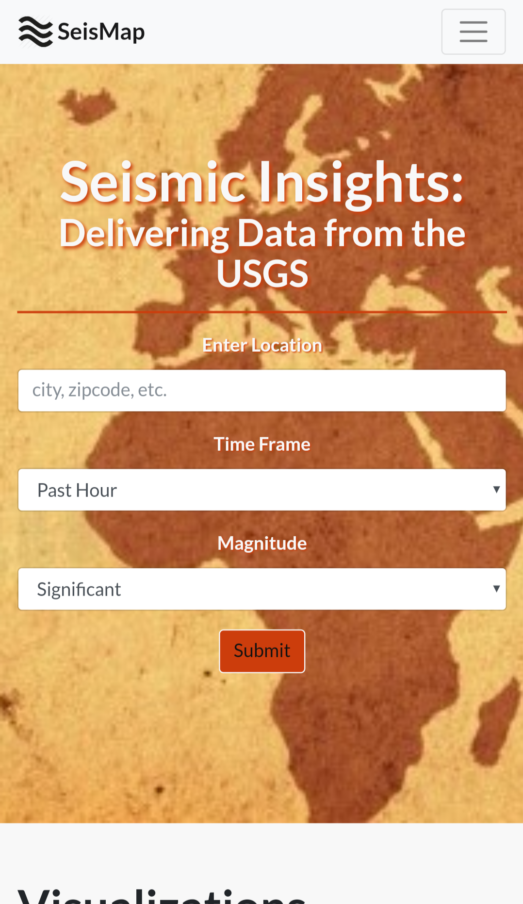
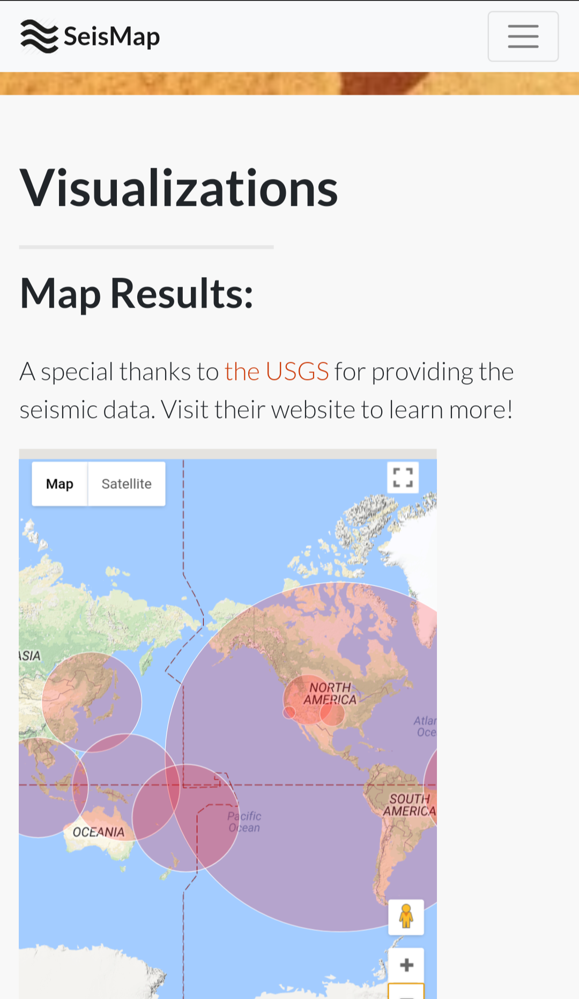
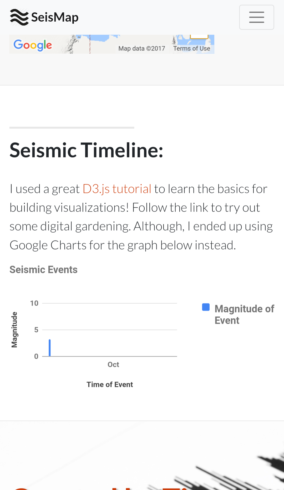
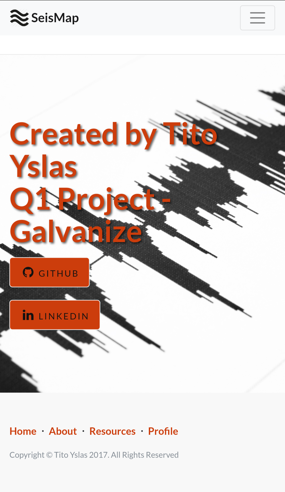

# SeisMap - Seismic Visualizations

### Motivation:
I lived in Los Angeles, CA for a few years and thought that it would be cool to create a webpage to deliver information about seismic activity. Fortunately, there is a wealth of data available that is collected by the United States Geological Survey (USGS) and many other agencies. So I got to work creating a webpage to make it easy for users to learn about the latest seismic events.

### Features:
* Center the map visualization at the location of your choosing
* Select the time frame of interest
  * Past Hour
  * Past Day
  * Past 7 Days
  * Past 30 Days
* Select the magnitudes of interest
  * Significant
  * Magnitude of 4.5+
  * Magnitude of 1.5+
  * All
* User input creates 2 visualization
  * Map - displays location of all reported seismic events within given time frame and range of magnitudes. Also scales out a circle that corresponds to the magnitude and shows information about the event when hovering over each circle.
  * Chart - timeline that summarizes all reported seismic events.

### Screenshots:

### Where do I find?:
* *[View Live Preview](https://g64wd-q1project-1505157828908.firebaseapp.com/)*

### Walk-through Video:

### APIs & Resources:
* [Google Geocoding API](https://developers.google.com/maps/documentation/geocoding/intro)
* [United States Geological Survey (USGS) - Earthquake Catalogue API](https://earthquake.usgs.gov/fdsnws/event/1/)
* [Google Maps JavaScript API](https://developers.google.com/maps/documentation/javascript/earthquakes)
* [Google Charts API](https://developers.google.com/chart/interactive/docs/)
